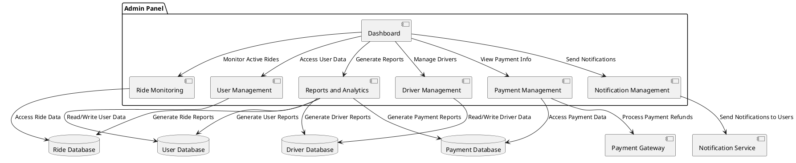

# Component Diagram of Admin Code

```plantuml
@startuml

' Define the system components for the Admin Panel
package "Admin Panel" {
    component "Dashboard" as Dashboard
    component "User Management" as UserManagement
    component "Driver Management" as DriverManagement
    component "Ride Monitoring" as RideMonitoring
    component "Payment Management" as PaymentManagement
    component "Reports and Analytics" as ReportsAnalytics
    component "Notification Management" as NotificationManagement
}

' External services used by the Admin Panel
database "User Database" as UserDB
database "Driver Database" as DriverDB
database "Ride Database" as RideDB
database "Payment Database" as PaymentDB
component "Notification Service" as NotificationService
component "Payment Gateway" as PaymentGateway

' Relationships between Admin Panel components
Dashboard --> UserManagement : Access User Data
Dashboard --> DriverManagement : Manage Drivers
Dashboard --> RideMonitoring : Monitor Active Rides
Dashboard --> PaymentManagement : View Payment Info
Dashboard --> ReportsAnalytics : Generate Reports
Dashboard --> NotificationManagement : Send Notifications

' Internal component interactions
UserManagement --> UserDB : Read/Write User Data
DriverManagement --> DriverDB : Read/Write Driver Data
RideMonitoring --> RideDB : Access Ride Data
PaymentManagement --> PaymentDB : Access Payment Data
ReportsAnalytics --> UserDB : Generate User Reports
ReportsAnalytics --> DriverDB : Generate Driver Reports
ReportsAnalytics --> RideDB : Generate Ride Reports
ReportsAnalytics --> PaymentDB : Generate Payment Reports

' External interactions
PaymentManagement --> PaymentGateway : Process Payment Refunds
NotificationManagement --> NotificationService : Send Notifications to Users

@enduml

```