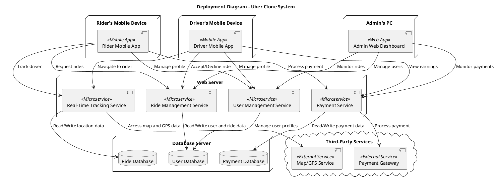

# Deployment Diagram Code

```plantuml
@startuml
title Deployment Diagram - Uber Clone System

node "Rider's Mobile Device" {
    [Rider Mobile App] <<Mobile App>>
}

node "Driver's Mobile Device" {
    [Driver Mobile App] <<Mobile App>>
}

node "Admin's PC" {
    [Admin Web Dashboard] <<Web App>>
}

node "Web Server" {
    [Ride Management Service] <<Microservice>>
    [Payment Service] <<Microservice>>
    [User Management Service] <<Microservice>>
    [Real-Time Tracking Service] <<Microservice>>
}

node "Database Server" {
    database "User Database" as UserDB
    database "Ride Database" as RideDB
    database "Payment Database" as PaymentDB
}

cloud "Third-Party Services" {
    [Payment Gateway] <<External Service>>
    [Map/GPS Service] <<External Service>>
}

' Connections
[Rider Mobile App] --> [Ride Management Service] : "Request rides"
[Rider Mobile App] --> [Payment Service] : "Process payment"
[Rider Mobile App] --> [Real-Time Tracking Service] : "Track driver"
[Rider Mobile App] --> [User Management Service] : "Manage profile"

[Driver Mobile App] --> [Ride Management Service] : "Accept/Decline ride"
[Driver Mobile App] --> [Real-Time Tracking Service] : "Navigate to rider"
[Driver Mobile App] --> [User Management Service] : "Manage profile"
[Driver Mobile App] --> [Payment Service] : "View earnings"

[Admin Web Dashboard] --> [Ride Management Service] : "Monitor rides"
[Admin Web Dashboard] --> [User Management Service] : "Manage users"
[Admin Web Dashboard] --> [Payment Service] : "Monitor payments"

[Ride Management Service] --> UserDB : "Read/Write user and ride data"
[Payment Service] --> PaymentDB : "Read/Write payment data"
[User Management Service] --> UserDB : "Manage user profiles"
[Real-Time Tracking Service] --> RideDB : "Read/Write location data"

[Payment Service] --> [Payment Gateway] : "Process payment"
[Real-Time Tracking Service] --> [Map/GPS Service] : "Access map and GPS data"

@enduml
```

