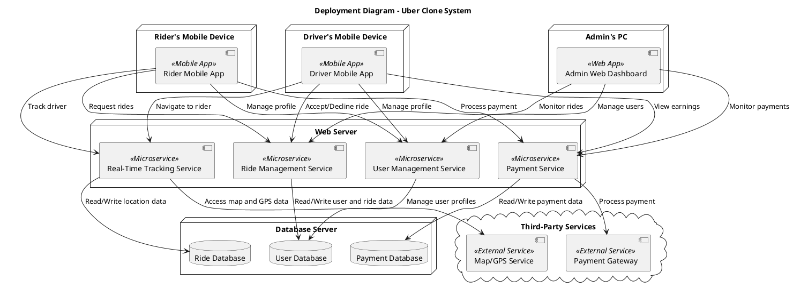

# System Context  Diagram Code

```plantuml
@startuml

' External Actors
actor "Rider (User)" as Rider
actor "Driver (User)" as Driver
actor "Admin" as Admin
actor "Payment Gateway" as PaymentGateway
actor "Map Service" as MapService
actor "Notification Service" as NotificationService
actor "Customer Support" as CustomerSupport

' System Boundary: Uber Clone App
package "Uber Clone App" {

    ' Subsystems
    rectangle "User Registration \nand Authentication" as Registration
    rectangle "Ride Booking \nand Management" as RideBooking
    rectangle "Driver Functionality" as DriverFunctionality
    rectangle "Payment Integration" as Payment
    rectangle "Ratings and Reviews" as Ratings
    rectangle "Admin Panel" as AdminPanel
    rectangle "Push Notifications" as PushNotifications
    rectangle "In-App Chat \nand Support" as ChatSupport
    rectangle "Real-Time Location Tracking" as Tracking
    rectangle "Customer Support" as Support
}

' Relationships between actors and system components
Rider --> Registration : Sign Up/Login
Rider --> RideBooking : Request Ride
Rider --> Payment : Process Payment
Rider --> Ratings : Rate Driver
Rider --> PushNotifications : Receive Notifications
Rider --> ChatSupport : In-App Chat with Driver

Driver --> Registration : Register/Login
Driver --> RideBooking : Accept Ride Request
Driver --> DriverFunctionality : Manage Availability
Driver --> Payment : Receive Payment
Driver --> Ratings : Rate Rider
Driver --> PushNotifications : Receive Ride Notifications
Driver --> ChatSupport : In-App Chat with Rider

Admin --> AdminPanel : Manage Users/Drivers/Rides
Admin --> RideBooking : Monitor Rides
Admin --> Payment : Monitor Payments
Admin --> PushNotifications : Send Notifications
Admin --> Ratings : Manage Reviews

' External Interactions
Payment --> PaymentGateway : Process Payment Transactions
Tracking --> MapService : Use Maps for Navigation
PushNotifications --> NotificationService : Send Notifications
Support --> CustomerSupport : Handle User Issues

@enduml
```

# Deployment Diagram Code

```plantuml
@startuml
title Deployment Diagram - Uber Clone System

node "Rider's Mobile Device" {
    [Rider Mobile App] <<Mobile App>>
}

node "Driver's Mobile Device" {
    [Driver Mobile App] <<Mobile App>>
}

node "Admin's PC" {
    [Admin Web Dashboard] <<Web App>>
}

node "Web Server" {
    [Ride Management Service] <<Microservice>>
    [Payment Service] <<Microservice>>
    [User Management Service] <<Microservice>>
    [Real-Time Tracking Service] <<Microservice>>
}

node "Database Server" {
    database "User Database" as UserDB
    database "Ride Database" as RideDB
    database "Payment Database" as PaymentDB
}

cloud "Third-Party Services" {
    [Payment Gateway] <<External Service>>
    [Map/GPS Service] <<External Service>>
}

' Connections
[Rider Mobile App] --> [Ride Management Service] : "Request rides"
[Rider Mobile App] --> [Payment Service] : "Process payment"
[Rider Mobile App] --> [Real-Time Tracking Service] : "Track driver"
[Rider Mobile App] --> [User Management Service] : "Manage profile"

[Driver Mobile App] --> [Ride Management Service] : "Accept/Decline ride"
[Driver Mobile App] --> [Real-Time Tracking Service] : "Navigate to rider"
[Driver Mobile App] --> [User Management Service] : "Manage profile"
[Driver Mobile App] --> [Payment Service] : "View earnings"

[Admin Web Dashboard] --> [Ride Management Service] : "Monitor rides"
[Admin Web Dashboard] --> [User Management Service] : "Manage users"
[Admin Web Dashboard] --> [Payment Service] : "Monitor payments"

[Ride Management Service] --> UserDB : "Read/Write user and ride data"
[Payment Service] --> PaymentDB : "Read/Write payment data"
[User Management Service] --> UserDB : "Manage user profiles"
[Real-Time Tracking Service] --> RideDB : "Read/Write location data"

[Payment Service] --> [Payment Gateway] : "Process payment"
[Real-Time Tracking Service] --> [Map/GPS Service] : "Access map and GPS data"

@enduml
```

