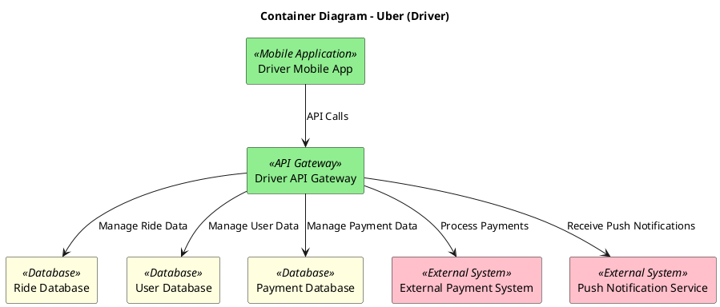
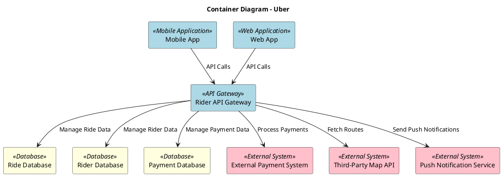
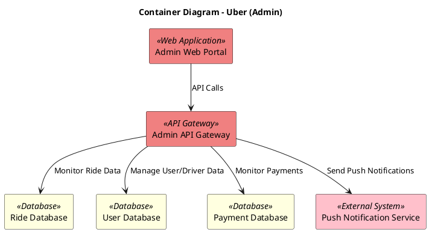
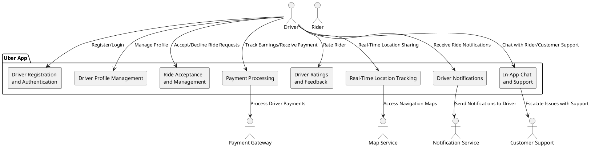
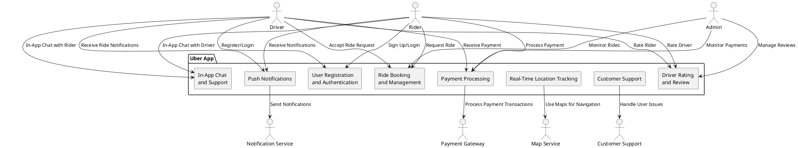
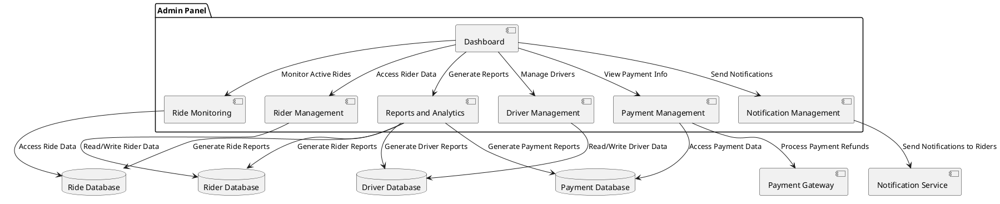
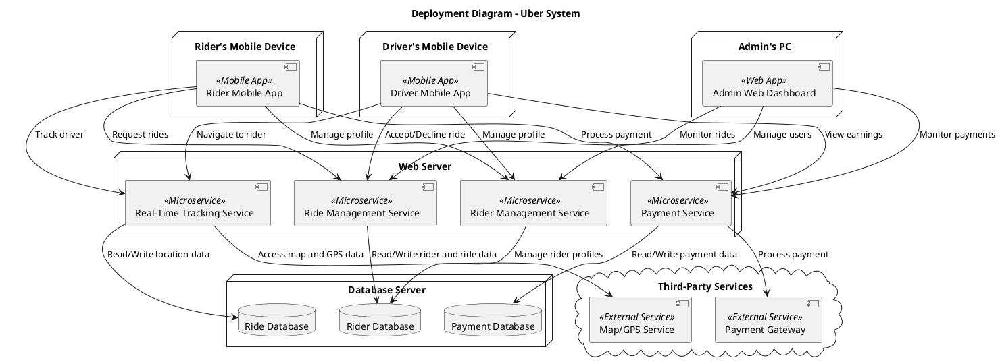

# System Context  Diagram Code

```plantuml
@startuml

' External Actors
actor "Rider (User)" as Rider
actor "Driver (User)" as Driver
actor "Admin" as Admin
actor "Payment Gateway" as PaymentGateway
actor "Map Service" as MapService
actor "Notification Service" as NotificationService
actor "Customer Support" as CustomerSupport

' System Boundary: Uber
package "Uber" {

    ' Subsystems
    rectangle "User Registration \nand Authentication" as Registration
    rectangle "Ride Booking \nand Management" as RideBooking
    rectangle "Driver Functionality" as DriverFunctionality
    rectangle "Payment Integration" as Payment
    rectangle "Ratings and Reviews" as Ratings
    rectangle "Admin Panel" as AdminPanel
    rectangle "Push Notifications" as PushNotifications
    rectangle "In-App Chat \nand Support" as ChatSupport
    rectangle "Real-Time Location Tracking" as Tracking
    rectangle "Customer Support" as Support
}

' Relationships between actors and system components
Rider --> Registration : Sign Up/Login
Rider --> RideBooking : Request Ride
Rider --> Payment : Process Payment
Rider --> Ratings : Rate Driver
Rider --> PushNotifications : Receive Notifications
Rider --> ChatSupport : In-App Chat with Driver

Driver --> Registration : Register/Login
Driver --> RideBooking : Accept Ride Request
Driver --> DriverFunctionality : Manage Availability
Driver --> Payment : Receive Payment
Driver --> Ratings : Rate Rider
Driver --> PushNotifications : Receive Ride Notifications
Driver --> ChatSupport : In-App Chat with Rider

Admin --> AdminPanel : Manage Users/Drivers/Rides
Admin --> RideBooking : Monitor Rides
Admin --> Payment : Monitor Payments
Admin --> PushNotifications : Send Notifications
Admin --> Ratings : Manage Reviews

' External Interactions
Payment --> PaymentGateway : Process Payment Transactions
Tracking --> MapService : Use Maps for Navigation
PushNotifications --> NotificationService : Send Notifications
Support --> CustomerSupport : Handle User Issues

@enduml
```

# Container Diagram Codes

## Driver Code

## Rider Code

## Admin Code

# Component Diagram
## Driver Code

## Rider Code

## Admin Code

# Deployment Diagram Code

## Chatgpt prompt used 
I am working on generating system diagrams (such as deployment, component, or container diagrams) for my project. Please provide detailed guidance, suggestions, and steps on how to structure the diagrams and what elements should be included.

